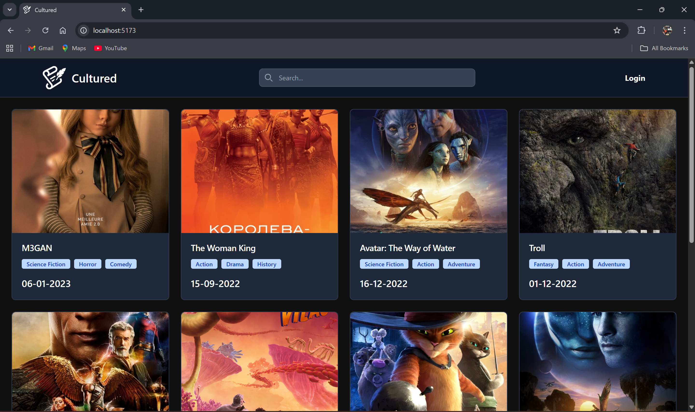

# The Cultured

Built a scalable movie review platform using Spring Boot for the backend and React for the frontend, following a loosely coupled architecture to allow independent development of client and server modules. Designed RESTful APIs and integrated MongoDB for efficient storage and retrieval of user-generated content and reviews. Implemented modular components to improve maintainability and scalability, supporting 100+ movies and real-time review updates.

Home Page

Movie Page